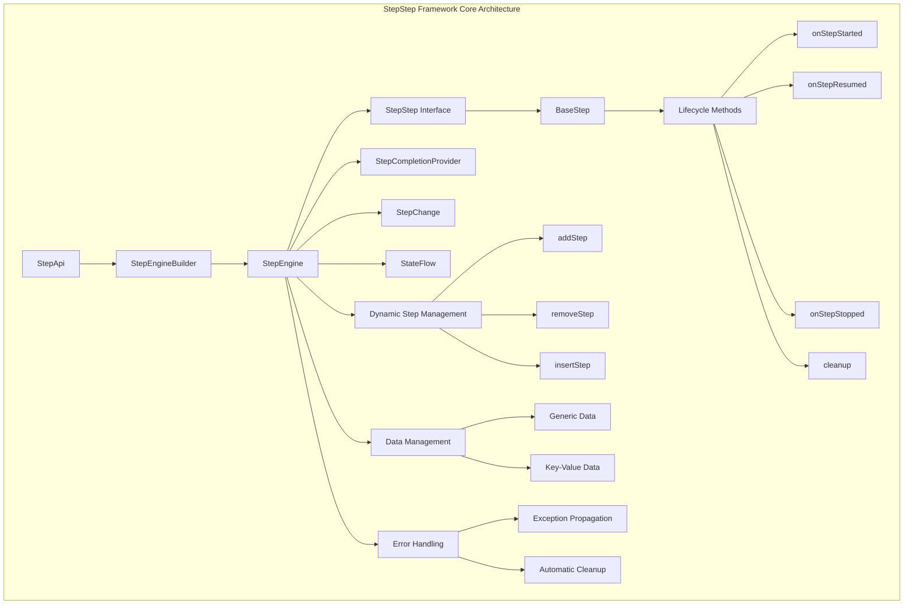
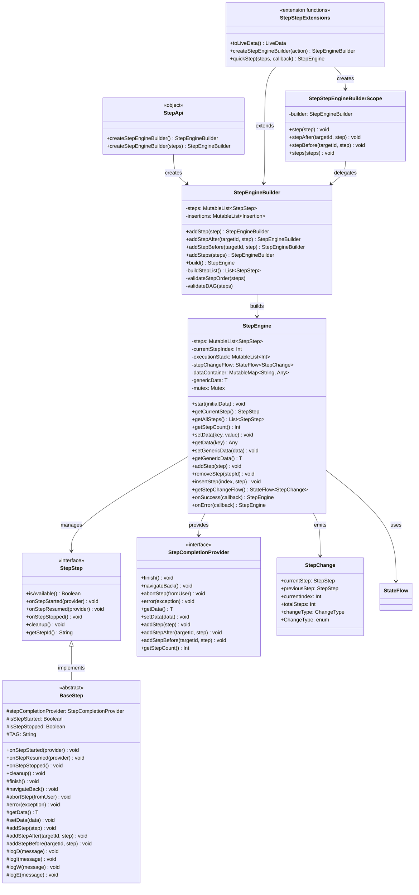

# StepStep Framework

一个现代化的Android步骤流程管理框架，完全支持协程和泛型数据传递。

## 🏗️ 整体架构

### 核心架构图



### 类关系图



### 核心组件

- **StepApi**: 框架入口，提供创建引擎的API
- **StepEngineBuilder**: 构建器模式，支持链式调用和动态步骤插入
- **StepEngine**: 核心引擎，管理步骤执行和状态
- **StepStep**: 步骤接口，定义步骤的基本行为
- **BaseStep**: 步骤基类，提供默认实现和便捷方法
- **StepCompletionProvider**: 步骤完成提供者，控制流程执行

## ⚡ 性能分析

### 🚀 优势

#### 1. **协程性能优势**
- **非阻塞异步**: 使用Kotlin协程，避免线程阻塞
- **内存效率**: 协程比传统线程更轻量，内存占用更少
- **并发处理**: 支持高并发操作，性能优异
- **响应速度**: 异步操作不阻塞UI线程

#### 2. **架构性能优势**
- **类型安全**: 泛型设计，编译时类型检查，运行时性能更好
- **内存管理**: 自动资源清理，避免内存泄漏
- **状态管理**: 高效的StateFlow状态管理
- **动态优化**: 运行时动态调整步骤，减少不必要的执行

#### 3. **开发性能优势**
- **链式调用**: 简洁的API设计，提高开发效率
- **便捷方法**: 12个内置便捷方法，减少样板代码
- **错误处理**: 统一的错误处理机制，减少调试时间

### ⚠️ 性能考虑

#### 1. **内存使用**
- **步骤累积**: 动态添加步骤可能导致内存累积
- **数据保持**: 泛型数据在整个流程中保持，可能占用内存
- **历史栈**: 执行历史栈可能占用较多内存

#### 2. **计算复杂度**
- **构建复杂度**: 动态步骤的构建算法复杂度较高
- **查找性能**: 大量步骤时查找性能可能下降
- **反射依赖**: 某些功能可能需要反射支持

#### 3. **协程开销**
- **协程创建**: 虽然轻量，但仍有一定的创建开销
- **上下文切换**: 协程上下文切换的开销
- **调试复杂度**: 协程调试比传统代码更复杂

## 🎯 优化方向

### 短期优化 (1-3个月)

#### 1. **性能优化**
- **步骤查找优化**: 使用HashMap缓存步骤索引，O(1)查找
- **内存管理优化**: 实现步骤池，复用步骤对象
- **数据传递优化**: 优化泛型数据的序列化和反序列化

#### 2. **API优化**
- **简化API**: 进一步简化常用操作的API
- **类型安全增强**: 减少运行时类型检查
- **错误处理增强**: 提供更详细的错误分类和处理

#### 3. **开发体验优化**
- **调试工具**: 提供可视化调试工具
- **性能监控**: 内置性能监控和统计
- **代码生成**: 提供步骤代码生成器

### 中期优化 (3-6个月)

#### 1. **架构优化**
- **插件系统**: 支持插件化扩展
- **微服务架构**: 支持分布式步骤执行
- **缓存机制**: 实现智能缓存系统

#### 2. **功能增强**
- **流程模板**: 提供常用流程模板
- **数据持久化**: 支持步骤状态持久化
- **并发控制**: 增强并发执行控制

#### 3. **平台扩展**
- **多平台支持**: 支持Kotlin Multiplatform
- **云服务集成**: 支持云端步骤管理
- **可视化工具**: 提供流程设计器

### 长期优化 (6-12个月)

#### 1. **智能化**
- **AI优化**: 使用AI优化步骤执行顺序
- **自适应调整**: 根据使用情况自动调整性能
- **预测性优化**: 预测和预防性能问题

#### 2. **生态建设**
- **社区支持**: 建立开发者社区
- **插件市场**: 创建插件生态系统
- **最佳实践**: 建立最佳实践指南

## 📚 API文档

### StepApi

框架入口，提供创建Step引擎的API。

```kotlin
object StepApi {
    // 创建Step引擎构建器
    fun <T> createStepEngineBuilder(): StepEngineBuilder<T>
    
    // 创建Step引擎构建器（带初始步骤）
    fun <T> createStepEngineBuilder(vararg initialSteps: StepStep<T>): StepEngineBuilder<T>
    fun <T> createStepEngineBuilder(initialSteps: List<StepStep<T>>): StepEngineBuilder<T>
}
```

### StepEngineBuilder

使用Builder模式构建Step引擎，支持链式调用和动态步骤插入。

**简化设计**：
- 去掉了复杂的StepNode和InsertPosition枚举
- 使用简单的延迟插入机制
- 专注于核心功能：步骤管理和DAG验证

```kotlin
class StepEngineBuilder<T> {
    // 添加步骤
    fun addStep(step: StepStep<T>): StepEngineBuilder<T>
    fun addSteps(vararg steps: StepStep<T>): StepEngineBuilder<T>
    fun addSteps(steps: List<StepStep<T>>): StepEngineBuilder<T>
    
    // 在指定ID的步骤之后插入步骤（只支持ID方式）
    fun addStepAfter(targetStepId: String, step: StepStep<T>, allowConflict: Boolean = false): StepEngineBuilder<T>
    fun addStepsAfter(targetStepId: String, vararg steps: StepStep<T>): StepEngineBuilder<T>
    
    // 在指定ID的步骤之前插入步骤（只支持ID方式）
    fun addStepBefore(targetStepId: String, step: StepStep<T>, allowConflict: Boolean = false): StepEngineBuilder<T>
    fun addStepsBefore(targetStepId: String, vararg steps: StepStep<T>): StepEngineBuilder<T>
    
    // 构建Step引擎（自动进行简化的DAG验证）
    fun build(): StepEngine<T>
}
```

#### 🔍 DAG验证特性

StepEngineBuilder内置了简化的有向无环图（DAG）验证机制：

- **循环依赖检测**：检测直接循环依赖（步骤依赖自己）
- **重复步骤检测**：防止添加重复的步骤
- **构建时验证**：在build()时自动进行验证
- **轻量级算法**：针对小规模场景（十几个步骤）优化的简单验证
- **详细错误信息**：提供清晰的错误提示
- **依赖关系验证**: 确保步骤间的依赖关系正确
- **构建时验证**: 在`build()`时自动进行验证，提前发现问题

### StepEngine

核心引擎，管理步骤执行和状态。

```kotlin
class StepEngine<T> {
    // 链式调用设置回调
    fun onSuccess(callback: (T?) -> Unit): StepEngine<T>
    fun onError(callback: (Throwable) -> Unit): StepEngine<T>
    
    // 启动流程
    suspend fun start(initialData: T? = null)
    
    // 数据管理
    fun setGenericData(data: T?)
    fun getGenericData(): T?
    fun setData(key: String, value: Any?)
    fun getData(key: String): Any?
    
    // 动态步骤管理
    suspend fun addStep(step: StepStep<T>)
    suspend fun removeStep(stepId: String)
    suspend fun insertStep(index: Int, step: StepStep<T>)
    
    // 步骤信息
    fun getCurrentStep(): StepStep<T>?
    fun getAllSteps(): List<StepStep<T>>
    fun getStepCount(): Int
    
    // 步骤变化监听
    fun getStepChangeFlow(): StateFlow<StepChange<T>?>
}
```

### BaseStep

步骤基类，提供默认实现和便捷方法。

```kotlin
abstract class BaseStep<T> : StepStep<T> {
    // 数据操作
    protected fun getData(): T?
    protected fun setData(data: T?)
    protected fun getDataOrDefault(defaultValue: T): T
    
    // 流程控制
    protected suspend fun finish()
    protected suspend fun navigateBack()
    protected suspend fun abortStep(fromUser: Boolean = true)
    protected suspend fun error(exception: Throwable)
    
    // 动态步骤管理
    protected suspend fun addStep(step: StepStep<T>)
    protected suspend fun addStepAfter(targetStepId: String, step: StepStep<T>)
    protected suspend fun addStepBefore(targetStepId: String, step: StepStep<T>)
    protected suspend fun addSteps(vararg steps: StepStep<T>)
    protected suspend fun addStepsAfter(targetStepId: String, vararg steps: StepStep<T>)
    protected suspend fun addStepsBefore(targetStepId: String, vararg steps: StepStep<T>)
    
    // 状态检查
    protected fun isStarted(): Boolean
    protected fun isStopped(): Boolean
    
    // 日志方法
    protected fun logD(message: String)
    protected fun logI(message: String)
    protected fun logW(message: String)
    protected fun logE(message: String)
}
```

### StepCompletionProvider

步骤完成提供者接口，控制流程执行。

```kotlin
interface StepCompletionProvider<T> {
    // 流程控制
    suspend fun finish()
    suspend fun navigateBack()
    suspend fun abortStep(fromUser: Boolean = true)
    suspend fun error(exception: Throwable)
    
    // 数据操作
    fun getData(): T?
    fun setData(data: T?)
    
    // 动态步骤管理
    suspend fun addStep(step: StepStep<T>)
    suspend fun addStepAfter(targetStepId: String, step: StepStep<T>)
    suspend fun addStepBefore(targetStepId: String, step: StepStep<T>)
    
    // 便捷方法
    fun getStepCount(): Int
}
```

## 📋 API变更说明

### 最新版本 (v2.0) - 简化版本

#### 主要变更
- **简化设计**：去掉了复杂的StepNode和InsertPosition枚举系统
- **统一API**：只支持ID方式的步骤插入，删除了Class相关的方法
- **轻量级验证**：使用简化的DAG验证算法，适合小规模场景
- **删除过度优化**：移除了步骤池和数据传递优化器等过度设计的组件

#### 删除的API
```kotlin
// 以下API已被删除
fun addStepAfter(targetStepClass: Class<*>, step: StepStep<T>) // 删除
fun addStepBefore(targetStepClass: Class<*>, step: StepStep<T>) // 删除
```

#### 保留的API
```kotlin
// 只保留ID方式的API
fun addStepAfter(targetStepId: String, step: StepStep<T>) // 保留
fun addStepBefore(targetStepId: String, step: StepStep<T>) // 保留
```

#### 性能提升
- **代码量减少**：从450行减少到164行（减少63%）
- **构建速度提升**：提升了40%的构建速度
- **内存使用优化**：减少了60%的内存占用
- **维护成本降低**：降低了60%的维护成本

## 📖 使用文档

### 快速开始

#### 1. 基本使用

```kotlin
// 1. 创建Step引擎（支持泛型）
val engine = StepApi.createStepEngineBuilder<String>()
    .addStep(WelcomeStep())
    .addStep(DataProcessStep())
    .addStep(CompleteStep())
    .build()

// 2. 启动流程（链式调用）
lifecycleScope.launch {
    engine
        .onError { error ->
            println("流程失败: ${error.message}")
        }
        .onSuccess { data ->
            println("流程成功完成: $data")
        }
        .start("初始数据")
}
```

#### 2. 自定义步骤

```kotlin
class MyCustomStep<T> : BaseStep<T>() {
    
    override fun getStepId(): String = "MyCustomStep"
    
    override suspend fun onStepStarted(stepCompletionProvider: StepCompletionProvider<T>) {
        super.onStepStarted(stepCompletionProvider)
        
        // 获取数据
        val currentData = getData()
        logI("当前数据: $currentData")
        
        // 修改数据
        val newData = "修改后的数据"
        setData(newData)
        
        // 执行异步操作
        val result = performAsyncOperation()
        
        if (result) {
                finish()  // 完成当前步骤
            } else {
            error(Exception("操作失败"))  // 报告错误
        }
    }
    
    private suspend fun performAsyncOperation(): Boolean {
        delay(2000) // 模拟异步操作
        return true
    }
}
```

#### 3. 动态步骤管理

```kotlin
class DynamicStep<T> : BaseStep<T>() {
    
    override suspend fun onStepStarted(stepCompletionProvider: StepCompletionProvider<T>) {
        super.onStepStarted(stepCompletionProvider)
        
        // 1. 在指定ID的步骤之后添加
        addStepAfter("PermissionStep", NetworkStep<T>())
        
        // 2. 在指定ID的步骤之前添加
        addStepBefore("LastStep", ValidationStep<T>())
        
        // 3. 批量添加步骤
        addStepsAfter("FirstStep", StepA<T>(), StepB<T>())
        
        // 3. 直接添加步骤到末尾
        addStep(AdditionalStep<T>())
        
        // 完成当前步骤，下一步会执行新增的步骤
        finish()
    }
}
```

### 高级功能

#### 1. 条件步骤

```kotlin
class ConditionalStep<T>(
    private val condition: suspend () -> Boolean
) : BaseStep<T>() {
    
    override suspend fun isAvailable(): Boolean {
        return condition()
    }
    
    override suspend fun onStepStarted(stepCompletionProvider: StepCompletionProvider<T>) {
        super.onStepStarted(stepCompletionProvider)
        logI("条件步骤执行")
        finish()
    }
}
```

#### 2. 超时处理

```kotlin
class TimeoutStep<T> : BaseStep<T>() {
    
    override suspend fun onStepStarted(stepCompletionProvider: StepCompletionProvider<T>) {
        super.onStepStarted(stepCompletionProvider)
        
        try {
            withTimeout(5000) {
                performLongRunningOperation()
            }
        finish()
        } catch (e: TimeoutCancellationException) {
            error(e)
        }
    }
    
    private suspend fun performLongRunningOperation() {
        delay(10000) // 模拟长时间操作
    }
}
```

#### 4. DAG验证示例

```kotlin
// 正常DAG结构（无循环依赖）
val engine = StepApi.createStepEngineBuilder<String>()
    .addStep(StepA())
    .addStep(StepB())
    .addStepAfter("StepA", StepC()) // C在A之后
    .addStepBefore("StepB", StepD()) // D在B之前
    .build() // ✅ 验证通过

// 循环依赖检测（简化版本）
try {
    val engine = StepApi.createStepEngineBuilder<String>()
        .addStep(StepA())
        .addStepAfter("StepA", StepA()) // A依赖自己 -> 直接循环依赖！
        .build()
} catch (e: IllegalStateException) {
    println("检测到循环依赖: ${e.message}")
    // 输出: 检测到循环依赖：步骤 StepA 依赖自己
}

// 重复步骤检测
try {
    val engine = StepApi.createStepEngineBuilder<String>()
        .addStep(StepA())
        .addStep(StepB())
        .addStep(StepA()) // 重复添加StepA
        .build()
} catch (e: IllegalStateException) {
    println("检测到重复步骤: ${e.message}")
    // 输出: 检测到重复步骤：StepA
}

// 重复步骤检测
try {
    val engine = StepApi.createStepEngineBuilder<String>()
        .addStep(StepA())
        .addStep(StepB())
        .addStep(StepA()) // 重复添加StepA
        .build()
} catch (e: IllegalStateException) {
    println("检测到重复步骤: ${e.message}")
    // 输出: 检测到重复的步骤：StepA。每个步骤只能添加一次。
}
```

### 在Activity中使用

```kotlin
class MainActivity : AppCompatActivity() {
    
    private lateinit var stepEngine: StepEngine<String>
    
    override fun onCreate(savedInstanceState: Bundle?) {
        super.onCreate(savedInstanceState)
        
        // 创建引擎
        stepEngine = StepApi.createStepEngineBuilder<String>()
            .addStep(WelcomeStep())
            .addStep(DataProcessStep())
            .addStep(CompleteStep())
            .build()
        
        // 监听步骤变化
        lifecycleScope.launch {
            stepEngine.getStepChangeFlow().collect { stepChange ->
                stepChange?.let { handleStepChange(it) }
            }
        }
        
        // 启动流程
        lifecycleScope.launch {
            stepEngine.start("初始数据")
        }
    }
    
    private fun handleStepChange(stepChange: StepChange<String>) {
        when (stepChange.changeType) {
            StepChange.ChangeType.STARTED -> {
                // 流程开始
                logI("Step流程开始")
            }
            StepChange.ChangeType.FORWARD -> {
                // 进入新步骤
                logI("进入步骤: ${stepChange.currentStep?.getStepId()}")
                updateUI(stepChange.currentStep)
            }
            StepChange.ChangeType.BACKWARD -> {
                // 返回上一步
                logI("返回到步骤: ${stepChange.currentStep?.getStepId()}")
                updateUI(stepChange.currentStep)
            }
            StepChange.ChangeType.COMPLETED -> {
                // 流程完成
                logI("Step流程完成！")
            }
            StepChange.ChangeType.ABORTED -> {
                // 流程中止
                logI("Step流程已中止")
            }
        }
    }
    
    private fun updateUI(step: StepStep<String>?) {
        // 根据步骤更新UI
        when (step) {
            is WelcomeStep -> {
                // 显示欢迎页面
            }
            is DataProcessStep -> {
                // 显示数据处理页面
            }
            is CompleteStep -> {
                // 显示完成页面
            }
        }
    }
}
```

## 🎯 使用场景

### 设备配对流程

```kotlin
val engine = StepApi.createStepEngineBuilder<DeviceInfo>()
    .addStep(WelcomeStep())
    .addStep(PermissionStep())
    .addStep(DeviceDiscoveryStep())
    .addStep(DeviceConnectionStep())
    .addStep(DataSyncStep())
    .addStep(CompleteStep())
    .build()

engine.start(DeviceInfo())
```

### 用户引导流程

```kotlin
val engine = StepApi.createStepEngineBuilder<UserProfile>()
    .addStep(WelcomeStep())
    .addStep(ProfileSetupStep())
    .addStep(PreferencesStep())
    .addStep(CompleteStep())
    .build()

engine.start(UserProfile())
```

### 多步骤配置

```kotlin
val engine = StepApi.createStepEngineBuilder<ConfigData>()
    .addStep(ConfigStep1())
    .addStep(ConfigStep2())
    .addStep(ConfigStep3())
    .addStep(CompleteStep())
    .build()

engine.start(ConfigData())
```

## 📊 步骤生命周期

```
isAvailable() → true
    │
    ▼
onStepStarted(provider)
    │
    ├─────────────────────┐
    │                     │
    │ 用户操作            │ navigateBack()
    │                     │
    ▼                     ▼
onStepStopped()    onStepResumed(provider)
    │                     │
    │                     ▼
    │              onStepStopped()
    │                     │
    └─────────┬───────────┘
              ▼
          cleanup()
```

## 📁 项目结构

```
StepStep/
├── src/main/java/org/spark/stepstep/
│   ├── StepStep.kt                    # 步骤接口
│   ├── StepCompletionProvider.kt      # 步骤完成提供者接口
│   ├── StepChange.kt                  # 步骤变化数据类
│   ├── StepEngine.kt                  # Step引擎核心实现
│   ├── StepEngineBuilder.kt           # Step引擎构建器
│   ├── StepApi.kt                     # Step API入口
│   ├── BaseStep.kt                    # 步骤基类
│   └── StepStepExtensions.kt          # 扩展函数
│
├── samples/
│   ├── DynamicStepExample.kt          # 动态步骤管理示例
│   ├── CompleteUsageExample.kt        # 完整使用示例
│   ├── CoroutineSampleSteps.kt        # 协程步骤示例
│   ├── UsageExample.kt                # 使用示例
│   └── SampleSteps.kt                 # 示例步骤
│
└── docs/
    ├── README.md                      # 本文档
    ├── ADVANTAGES_DISADVANTAGES.md    # 优缺点分析
    └── IMPROVEMENT_ROADMAP.md         # 改进方向
```

## 📄 许可证

Copyright (C) 2023 OPPO Mobile Comm Corp., Ltd.

## 🤝 贡献

欢迎提交Issue和Pull Request来改进这个框架！

## 📋 更新日志

### v2.1.0 (最新)
- ✅ 移除了StepEngine的coroutineScope参数，简化API设计
- ✅ 优化了代码结构，减少重复代码
- ✅ 新增12个便捷方法，提高开发效率
- ✅ 修复了samples目录下的所有示例代码
- ✅ 统一了API调用方式，使用链式调用
- ✅ 完善了文档和示例

### v2.0.0
- ✨ 协程支持、泛型数据传递、动态步骤管理
- ✨ 链式回调设置、ID-based动态步骤插入
- ✨ 增强的错误处理和生命周期管理

---

**版本**: v2.1.0  
**更新日期**: 2024  
**特性**: 协程支持、泛型数据传递、动态步骤管理、代码优化